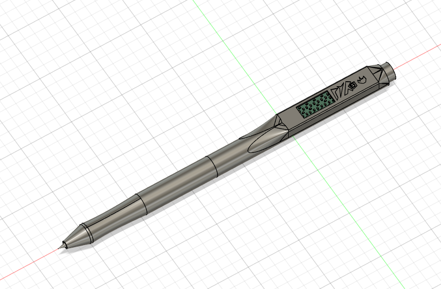
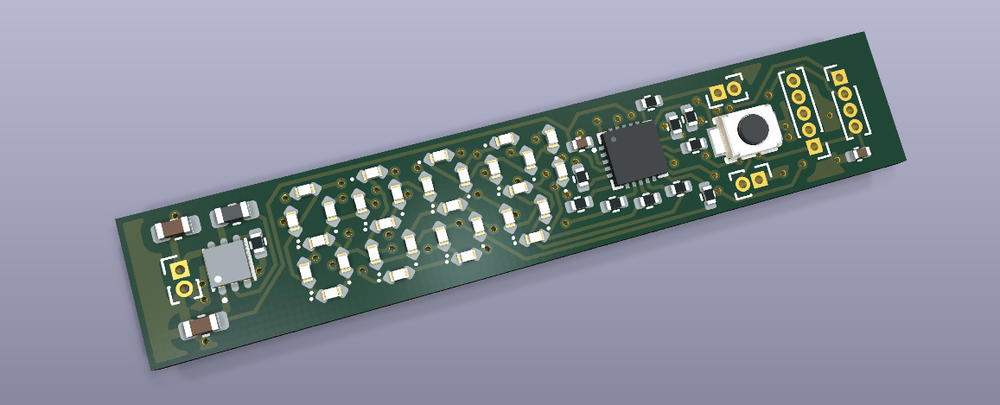
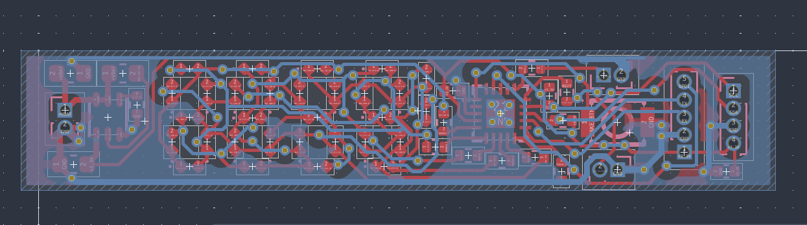
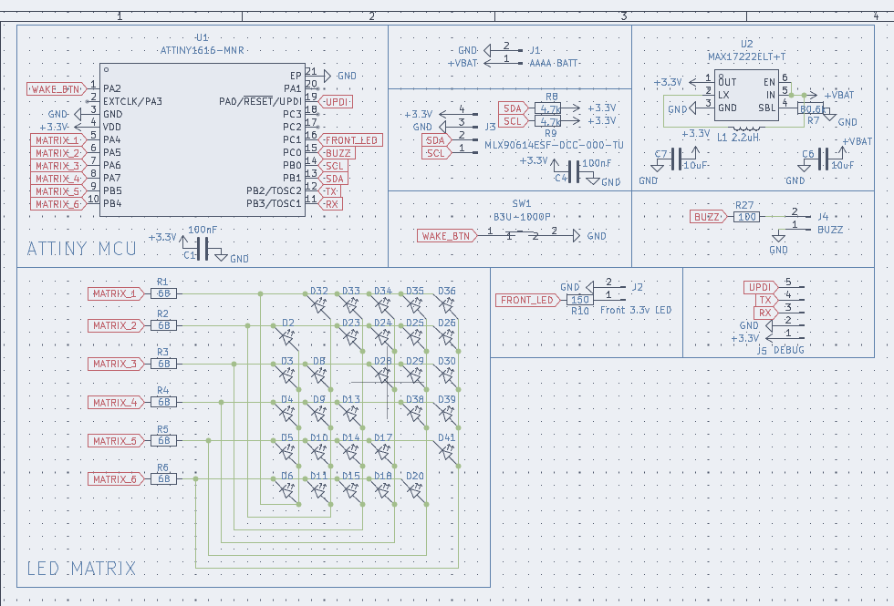

# Pyropen
A pen with an embedded charlieplexed screen and thermal sensor

## 3D Model Preview

## 3D PCB Preview

## Wiring

## Schematic

## Introduction
Hobby electronics projects can come with a lot of dangers, especially if there is a short between ground and the main voltage line through a component, which is one of the most common faults when hand soldering. These components can get really hot which means placing your finger to sense the temperature is not a super safe option, and is also not very possible for really small components in tight areas. Theres also hundreds of other applications like seeing if a soldering iron is at the good temperature or if something is being heated properly where touching it is not very recommended... 

My solution to this is the PyroPen, a portable thermal sensor that fits in the palm of your hand and can also be used as a regular pen!

## Bill of Materials 

### 5 Pens:

| Quantity | Components | Price | Link |
|--------- |----------|----------| -----|
| 5  | D1 Mini Pen Refill  (around 67mm long) | $12 | [here](https://www.amazon.com/DUNBONG-5-Pack-0-7mm-Ballpoint-Refills/dp/B07WPVYPBQ?adgrpid=1344703292210077&dib=eyJ2IjoiMSJ9.dkU02pPqqi8_qvMvz6ROdgwvY2PfLFoZA5NHRPEMEOmx9v3SJ4tJV2dAopaTP8eJpF3sMsSZ75bQOesdZQNrow5U1RewVGZaKX3aSEySK52mwLqTkCdqqBvEi0AiptNVk3AsemRQg0aZi-8WCHJmaaAukQLnTeK6H5vKfyB41Cd4iiIW4FD6n3z0_4jz8MTdtnKAD1H0LzsR06JqSmcmOj8UHi9I8X21a6u2Zs9yXuCjZB8GFQ1BZRn1klLhBPBG6UOqBzpa1yUwIAutZIo253xLEKYicqVJO6qxfIexFzI.6GHFUMJ_bxEV6sJABqV1cI7MuSSWcePbHHFFWMkL9IE&dib_tag=se&gb=2&hvadid=84044194397740&hvbmt=be&hvdev=c&hvexpln=0&hvlocphy=111976&hvnetw=o&hvocijid=2261200049635150351--&hvqmt=e&hvtargid=kwd-84044314381441%3Aloc-190&hydadcr=10665_13482490&keywords=d1%2Bmini%2Bpen%2Brefill&mcid=1999c080263b35e78135e3d970be132e&qid=1789152702&sr=8-9&th=1)

Total cost: **$e**

Cost per pen: **$e**

----

## Tools / Other parts:
- M8 tap and M8 die
- Hot glue + hot glue gun

## Assembly
1. 